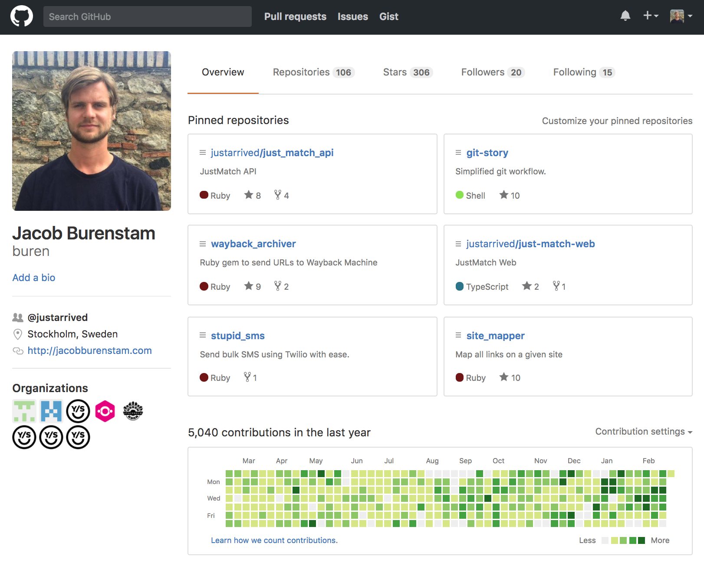

```ruby
include OpenHack

author = Presenter.new(:buren)
slides = Hackathon::Slides.new

wait until author.ready?

author.present(slides) do |slide|
  print slide
  any_questions? if slide.last?
end
```

_Goto_: http://jacobburenstam.com/openhack-uppsala


---


Guide \| Empower \| Connect

---

The mission of Just Arrived is enrich and empower the labor market by guiding, empowering and connecting foreign-born competence with the staffing needs of Swedish companies.

---

We envision ourselves being the most trusted  go to-place for all foreign-born in need of work.

---

Built up by over 200 volunteers, representing 60 companies and authorities in Sweden, we now work with over 100 customers and have users from over 100 countries, speaking more than 80 different languages.

---

# GOTO

## [jacobburenstam.com/openhack-uppsala](http://jacobburenstam.com/openhack-uppsala)

---

<div data-poller="js-poll-developer-openhack">
  <p>Developer?</p>
  <button data-answer>Neckbeard</button>
  <button data-answer>Ninja</button>
  <button data-answer>OK</button>
  <button data-answer>Not so much</button>
  <button data-answer>Developer?</button>
  <hr>
  <div data-chart data-refresh="5"></div>
</div>

---

<div data-poller="js-openhack-hackathon">
  <p>How many hackathons have you been too?</p>
  <button data-answer>1</button>
  <button data-answer>2</button>
  <button data-answer>3</button>
  <button data-answer>4</button>
  <button data-answer>5+</button>
  <hr>
  <div data-chart data-refresh="5"></div>
</div>

---

# I have a special relationship with OpenHack

---

# Malmö December, 2015

### First lines of code written for Just Arrived

# @ OpenHack

---

### Disclaimer

* __Personal__ opinions, __not__ the opinions of my employer.
* YMMV (Your mileage may vary)

---

## Jacob Burenstam

* Open source tinkerer
* Useless code enthusiast
* Co-Founder and CTO at Just Arrived

<hr>

* [github.com/buren](https://github.com/buren)
* [keybase.io/buren](https://keybase.io/buren)

---

# I love open source



---

#### By the way

# Just Arrived is 100% open source :heart:

[github.com/justarrived](https://github.com/justarrived)

---

## Access to information has changed the world

---

## Our challenge

How can I find more information and/or a guide on how I can get my first job i Sweden?

---

## Fragmented information

Currently information for job seekers are spread out.

Arbetsförmedlingen, Skatteverket, Migrationsverket, Försäkringskassan etc

---

### Mission 1

Could the best guides and information be curated by harvesting insights from the many?

---

### Mission 2

Also, is it possible to curate the best information from different authorities and institutions and present it in one place?

---

## Bonus mission

Conceptualize how can users rate/vote/give feedback on content?

---

### Constraints

We all believe in the web. It’s open, searchable, linkable and accessible in a way that native apps, frankly, are not

---

Wikipedia/Stack Overflow for job seekers?

---

Remember the code from the first slide?

```ruby
include OpenHack

author = Presenter.new(:buren)
slides = Hackathon::Slides.new

wait until author.ready?

author.present(slides) do |slide|
  print slide
  any_questions? if slide.last?
end
```

---

```ruby
DEADLINE = Time.new(2016, 5, 18, 19, 0, 0).freeze
module OpenHack;end
module OpenHack::Hackathon;end
String.class_eval { define_method(:last?) { false } }
NilClass.class_eval { define_method(:last?) { true } }
define_method(:wait) { puts 'Still not ready..';sleep 3 }
define_method(:any_questions?) { puts 'Any questions?' }
define_method(:feedback) { puts 'Feedback?' }
class OpenHack::Presenter < Struct.new(:name)
  define_method(:ready?) { Time.now >= DEADLINE }
  def present(slides); slides.to_a.each { |slide| yield(slide) };end
end
class OpenHack::Hackathon::Slides
  define_method(:initialize) { @slides = File.read('slides.md').split('---') }
  define_method(:to_a) { @slides + [nil] }
end
```

This actually makes the previous code work :trollface:

---

* [http://git.io/vnWsf](http://git.io/vnWsf)


---

# Build something awesome

---


Guide \| Empower \| Connect

---

# Questions?

## github.com/buren
## keybase.io/buren


---


<!-- Third party dependencies -->
<script src="js/libs/jquery.js"></script>
<!-- <script src="js/libs/highcharts.js"></script> -->
<script src="https://www.google.com/jsapi"></script>
<script src="js/libs/chartkick.js"></script>

<!-- JavaScript -->
<script src="js/log.js"></script>
<script src="js/resize-hack.js"></script>

<script>
  PollerConfig = { url: 'https://throwawaypoll.herokuapp.com' };
</script>
<script src="js/poller.js"></script>
<script src="js/poller-dom.js"></script>
<script>
  PollerConfig = { url: 'https://throwawaypoll.herokuapp.com' };
</script>
